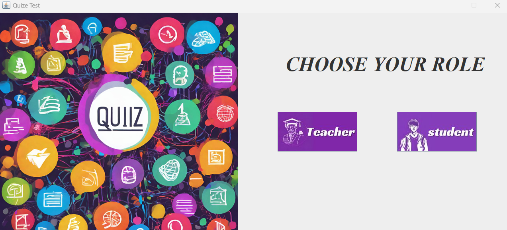
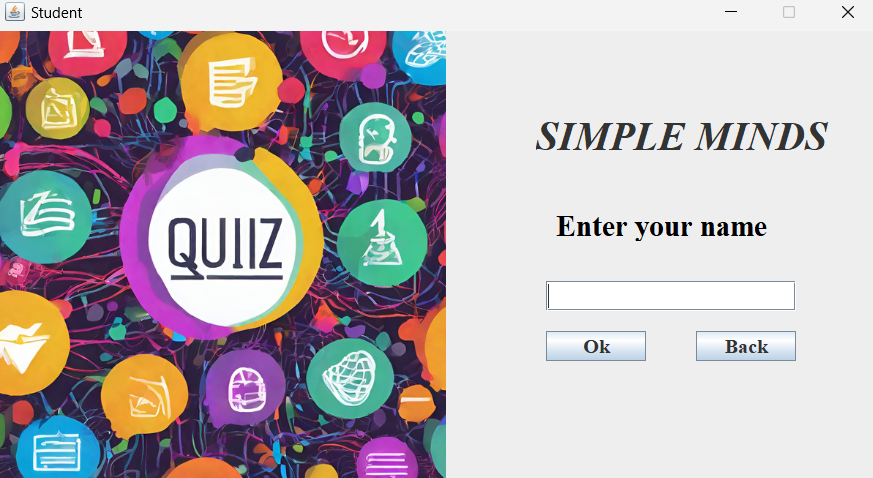
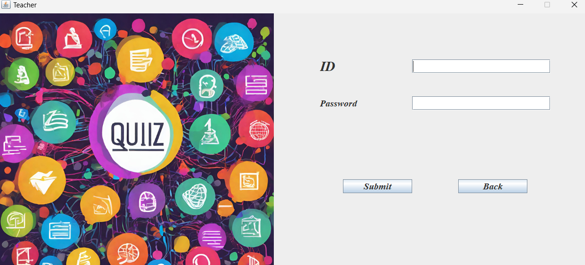
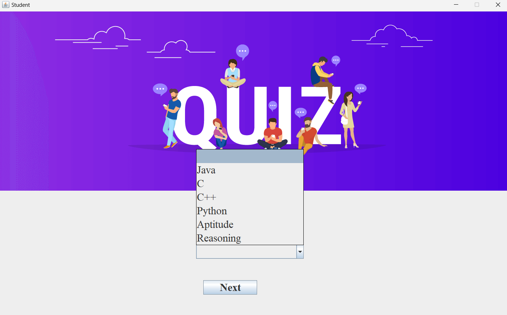
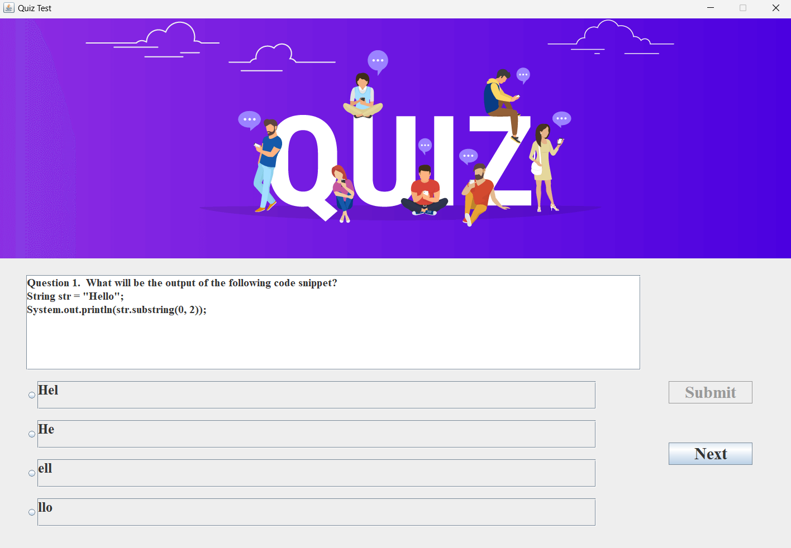
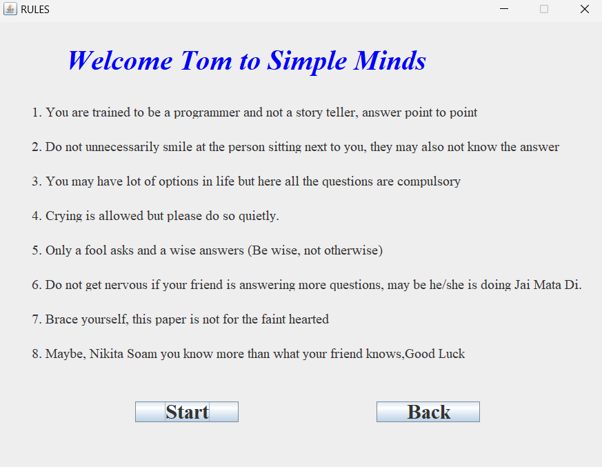
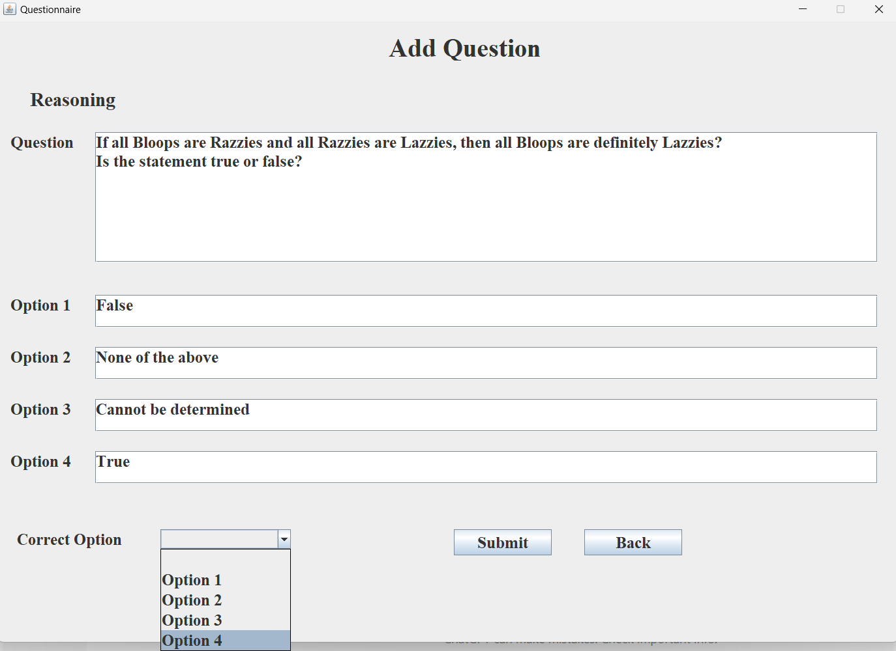

# 📚 Smart Quiz Application

A Java-based quiz system built using basic tools like **Notepad** and **MySQL Workbench**. It supports two user roles — **Teacher** and **Student** — and enables secure quiz creation, participation, and result tracking for multiple courses.

---

## 🚀 Features

### 👩‍🏫 Teacher Role
- Secure login using teacher credentials  
- View student attempts and scores for each course  
- Add new quiz questions to any subject (Java, C, C++, Python, Aptitude, Reasoning)  

### 👨‍🎓 Student Role
- Enter name and view quiz instructions  
- Choose a course and start quiz  
- 10 random questions fetched from the MySQL database  
- View final score after submission  
- Option to play again by re-entering name

---

## 💻 Technologies Used

| Component      | Technology         |
|----------------|--------------------|
| Frontend       | Java (via Notepad) |
| Backend Logic  | Java (Console-based or basic UI) |
| Database       | MySQL (Workbench)  |
| Tools Used     | Notepad, Command Prompt, MySQL Workbench |

---

## 🗃️ Example Table Structure

```sql
CREATE TABLE python (
  QuestionID INT AUTO_INCREMENT PRIMARY KEY,
  Question TEXT NOT NULL,
  Option1 VARCHAR(255),
  Option2 VARCHAR(255),
  Option3 VARCHAR(255),
  Option4 VARCHAR(255),
  CorrectOption VARCHAR(255)
);

# 📸 Screenshots
You can add screenshots here after uploading images in your GitHub repo:













# 📦 How to Run the Project

1.Open .java files using Notepad (or any text editor).
2.Compile and run from Command Prompt:

  javac Role.java
  java Role
3.Create required tables using MySQL Workbench (manually or by importing a .sql file).
4.Ensure your database connection in Java (Connection, DriverManager, etc.) matches your MySQL setup.

# 🧠 Future Enhancements
Add graphical user interface (GUI) using Swing or JavaFX

Implement quiz timer functionality

Enable teachers to delete or update questions

Generate downloadable student performance reports

📄 License
This project is for educational and portfolio purposes. You are free to modify and reuse it.

### ✅ How to Use This
1. **Create a new file** in your GitHub repo named `README.md`
2. **Copy and paste** the entire content above into that file.
3. GitHub will automatically render the headings, tables, and code nicely.

Let me know if you want to add **screenshots**, **author name**, or **GitHub profile badge**!
